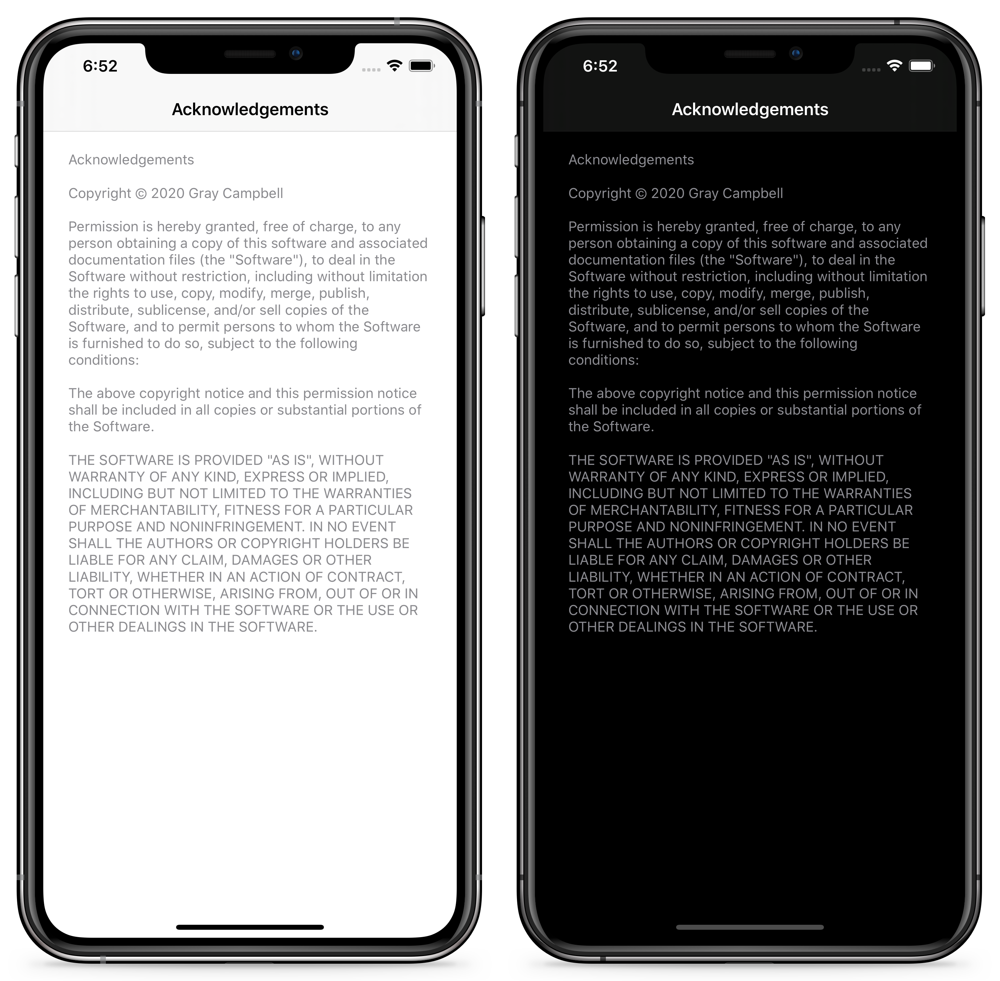

## Installation

`Acknowledgements` is available as a [Swift Package](https://developer.apple.com/documentation/swift_packages). You can find information on how to add package dependencies to your app [here](https://developer.apple.com/documentation/xcode/adding_package_dependencies_to_your_app).

## Usage

```swift
import Acknowledgements
```

```swift
extension Acknowledgement {
    static let openSourceFramework = Acknowledgement(name: "Framework", copyright: "Copyright © YYYY Author's Name", license: .MIT)
}
```

```swift
let acknowledgementsVC = AcknowledgementsViewController(acknowledgements: [.openSourceFramework, .acknowledgements])
```
